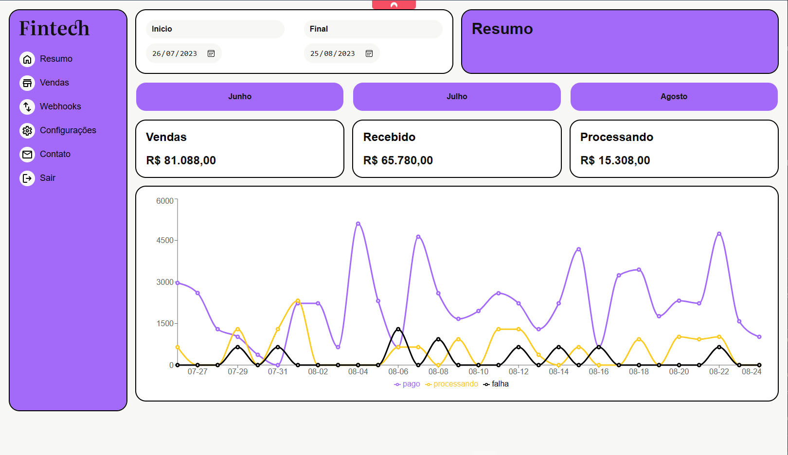

# Fintech - React with Typescript
Creating a project with React with Typescript. Creating a Dashboard to control spending, sales and payment status. The project was built using Vite, React, Typescript, React Router Dom and Recharts.

First, install the dependencies:

```bash
npm install
```
Second, run the application development:

```bash
npm run dev
```

| :placard: About More|     |
| -------------  | --- |
| :sparkles: Nome        | **Fintect**
| :label: Tecnologias | Typescript, React, Vite, Recharts, React Router Dom

